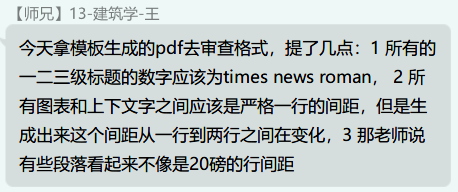
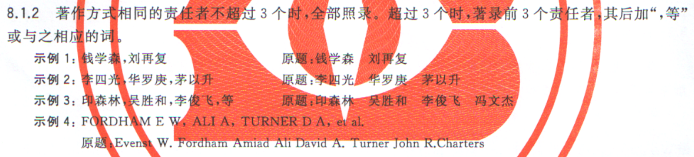

# 重庆大学毕业论文排版规范(2021.01.10)

为了方便对毕业论文的排版，这里根据本科论文的毕业论文写作要求，总结抽离了排版要求（仅抽离了**排版**要求），按照**规范的Word排版习惯**进行组织。该文档的目的是：**抽离所有的排版要求，尽可能的使用户在没有范例文档的情况下也能完全独立的排版出符合规范的文档，并在排版设计较为复杂的地方给出一些提示**

规范来源：见[符号定义](#符号定义)章节

在阅读完研究生的毕业论文排版规范后发现：**本科生的毕业论文排版规范本质是研究生毕业论文排版规范的简化，且二者有高度的相容性**。故这里的规范先以本科的毕业论文排版规范为基础，后以研究生的排版规范为补充，把二者的不同加粗标注

## 符号定义

为说明格式规范来源，在对应内容尾部采用括号说明，这里对括号内容进行说明

- 仅数字，如：1.1
  - 来自19年本科排版规范《附件 3 重庆大学普通本科毕业设计（论文）撰写规范要求》的某**章节号**
  - 文件修改日期为2017年，2019年沿用
  - 文件内容核心大致采纳自研究生版本的排版要求，可以看出复制粘贴的痕迹
- 带字母E（Example），如：E11
  - 来自本科19年排版范例《附件4 重庆大学普通本科毕业设计（论文）模版201904》的某**页面**
- 带字母Y（研究生），如：Y1.1.1
  - 来自研究生19年排版规范《附件：重庆大学博士、硕士学位论文撰写格式标准及要求（2019年修订）》的某**章节号**
- 带字母YEL（研究生Example理科），如：YEL29
  - 来自研究生19年采用顺序编码制的排版范例《附录5：  2019 博士、硕士论文格式范本（顺序编码制范本）》的某**页面**
- 字母U
  - 来自用同学的反馈，附上图片作为来源

## 关于查重&格式审查

根据于2020年12月反映的的情况

- 查重现在可以提交PDF文档(U)
- 可以使用LaTeX排版(U)

  

- 格式审查最好提供Word文件(U)

  

---

- [重庆大学毕业论文排版规范(2021.01.10)](#重庆大学毕业论文排版规范20210110)
  - [符号定义](#符号定义)
  - [关于查重&格式审查](#关于查重格式审查)
  - [论文结构(3.2,Y3)](#论文结构32y3)
  - [样式](#样式)
    - [主题字体](#主题字体)
    - [正文&参考文献&附录](#正文参考文献附录)
    - [题注脚注页眉页脚尾注](#题注脚注页眉页脚尾注)
    - [标题样式](#标题样式)
    - [编号](#编号)
      - [标题编号(5.2.1)](#标题编号521)
      - [题注编号](#题注编号)
      - [脚注编号(5.4.4)](#脚注编号544)
    - [特殊样式](#特殊样式)
  - [特殊部分](#特殊部分)
    - [页面纸张(2.1)](#页面纸张21)
    - [页眉页脚](#页眉页脚)
      - [页眉(2.2)](#页眉22)
      - [页脚(2.3, 2.4, 6.2)](#页脚23-24-62)
    - [封面](#封面)
      - [封面内容要求(4.2)](#封面内容要求42)
      - [格式要求(E1)](#格式要求e1)
    - [摘要(4.4)](#摘要44)
    - [目录(4.6)](#目录46)
      - [目录内容要求](#目录内容要求)
      - [目录样式(E5)(YEL7)](#目录样式e5yel7)
      - [疑难杂症](#疑难杂症)
    - [参考文献(5.7)](#参考文献57)
      - [多个作者省略的“等”字问题](#多个作者省略的等字问题)
    - [附录](#附录)
    - [表格&图片](#表格图片)
      - [表格(E6)](#表格e6)
      - [图片](#图片)
    - [公式(Y4.2.2④)](#公式y422)
  - [存在的问题&需要注意的地方](#存在的问题需要注意的地方)
  - [TODO](#todo)

## 论文结构(3.2,Y3)

- 封面
  - 本科和研究生的排版要求中同时提到了“封面”和“中英文题名页”，见(3, 4)和(Y4.1.1, Y4.1.2)
  - 从(Y4.1.1)的内容来看，封面应该属于由学校或学院单独打印发放的一页文档，手动填写后放在论文最上方装订，不在电子排版的讨论范围内
  - 故后方提到的“封面”，均指“题名页”
- 中文封面（题名页）
- 英文封面（题名页）
- （分节）
- 中文摘要（含关键词）
- 英文摘要（含关键词）
- 目录
- 插图和附表清单（即图目录，表目录）（非必须，暂不处理）
- 符号、标志、缩略词、首字母缩写、计量、单位、术语等注释表(即符号术语表)（非必须，暂不处理）
- （分节）
- 正文
  - 引言（续论）(5.3)
  - 正文(5.4)
  - 结论与展望(5.5)
  - 致谢(5.6)
  - 参考文献(5.7)
- 附录(6,Y3,Y4.4.2,YEL57)
  - （以下针对研究生）
  - 学位申请人在攻读学位期间发表的论著、取得的科研成果
  - 阅读型参考文献
  - 学位论文数据集
- 致谢(Y4.5)

## 样式

这里只列出主要字体，关键词等局部使用的字体见相关部分

### 主题字体

“设计”选项卡内的“字体”设置，定义“标题”和“正文”字体，可以直接替换这里的字体，实现一次性更改文档字体的效果

- 中文标题：黑体
- 中文正文：宋体
- 西文标题：Times New Roman
- 西文正文：Times New Roman

### 正文&参考文献&附录

注意！

**关于行距**：规范中的行距的要求均为“固定值20磅”，**但是，对于有行内公式的段落，行内公式如果出现了大型运算符比如分数，求和符号等，固定值20磅会导致公式显示不完整**，为了解决这个问题，应该将所有的固定行距20磅设置为“**最小值20磅**”！详见[公式](#公式y422)部分

- 正文(2.5, Y4.2.2)
  - 字体
    - 字体：正文字体
    - 字号：小四
    - 字体间距：标准
  - 段落
    - 首行缩进：2字符(Y4.1.3①)
    - 段前段后：0行(Y4.1.3①)
    - 行距：固定值 20磅
- 参考文献(E7)
  - 继承正文，字号五号，悬挂缩进
  - 字体：
    - 字体：正文字体
    - 字号：五号
  - 段落
    - 左对齐
    - 悬挂缩进：2字符
    - 行距：固定值 20磅
- 附录(E10)
  - 继承正文，字号五号
  - 字体：
    - 字体：正文字体
    - 字号：五号
  - 段落
    - 首行缩进：2字符
    - 行距：固定值 20磅

### 题注脚注页眉页脚尾注

- 题注(5.4.1)
  - 字体
    - 字号：五号
    - 字体：正文字体
  - 段落
    - 居中（E6）
    - 段前段后：0行(E6)
    - 行距：固定值 20磅(E6)
- 为实现图片和表格的前后间距，将图片题注和表格题注作为两个样式分开设定

---

- 脚注：
  - 字号：小五(YEL12)
  - 单倍行距(YEL12)
- 页眉(2.2)
  - 字体
    - 字体：正文字体
    - 字号：小五（**研究生要求五号**憨批玩意本科在前面加个`小`字(YEL,Y4.2.2⑨)）
  - 段落
    - 单倍行距
  - 边框
    - 下分隔线
- 页脚：
  - 字号：小五(YEL)
  - 单倍行距(YEL)
- TODO 尾注(Y4.2.2⑤②)
  - 尾注（仅限外国语学院MLA格式使用）：注释与正文分开。注释要另起一页，此页标题为 Notes (居中、正文文字格式、不加上引号或斜体)，位置在“Works Cited”页之前。注释须按连续的、上标式的阿拉伯数字排列，并使用普通段落格式、双倍行距（一个注释自成一段）。

### 标题样式

除标题外，摘要、目录、参考文献、附录，同时适用一级标题样式，只需手动取消编号

注意！

**段前段后1行与实际空一行的区别**TODO

- 一级标题
  - 字体(5.2.1)
    - 字号：三号
    - 字体：标题字体
  - 段落
    - 居中(5.2.1)
    - 段前段后：1行(E4)(Y4.1.3①)
    - 行距：固定值 20磅(E6)(Y4.1.3①)
    - 段前分页(5.1)
- 二级标题
  - 字体(5.2.1)
    - 字号：小三
    - 字体：标题字体
  - 段落
    - 左对齐(5.2.1)
    - 首行缩进：无(E6)
    - 段前：一行（根据5.1的要求，参考YEL中二级标题的实现，应该如此）
    - 段后：0行(E6)
    - 行距：固定值 20磅(E6)
- 三级标题
  - 字体(5.2.1)
    - 字号：四号
    - 字体：标题字体
  - 段落
    - 左对齐(5.2.1)
    - 首行缩进：无(E6)
    - 段前段后：0行(E6)
    - 行距：固定值 20磅(E6)
- 四级标题
  - 字体(5.2.1)
    - 字号：继承正文
    - 字体：继承正文
- 五级标题(5.2.1)
  - 同四级
- 更多未定义，继承正文

### 编号

#### 标题编号(5.2.1)

摘要、目录、参考文献、附录，**均无前缀编号**

- 文科（文、法、教育等）**（研究生排版中要求所有标题均采用理工式的编号(Y4.2.2①)）**

  | 标题层级 | 序号样式 |
  | :------- | :------- |
  | 1        | 一、     |
  | 2        | （一）   |
  | 3        | 1.       |
  | 4        | （1）    |
  | 5        | 第一.    |

- 理工经管

  | 标题层级 | 序号样式             |
  | :------- | :------------------- |
  | 1        | 1 （后方两空格）     |
  | 2        | 1.1 （后方一空格）   |
  | 3        | 1.1.1 （后方一空格） |
  | 4        | ① （后方一空格）    |
  | 5        | 1） （后方一空格）   |
  | 6        | a. （后方一空格）    |

  - 编号(E7)
    - 编号字体：
      - 本科例子：中文标题(无衬线黑体)
      - **研究生例子：西文标题**（衬线新罗马）
      - 根据同学于2020年12月提供的信息，（研究生）标题编号的数字应当使用新罗马字体(U)（图中第1条，其他部分勿看）

        

    - 编号对齐方式：左对齐
    - 文本缩进位置：0厘米
    - 对齐位置：0厘米
    - 编号之后：不特别标注
  - **理工的四级标题编号的带圈字符编号无法直接在Word中实现**，需要使用骚操作，这里不表

#### 题注编号

- 作用域：摘要
  - 根据(Y4.1.3)，摘要尽量避免图片表格出现，如果确实遇到这样的极端情况，建议直接不编号
- 作用域：正文(5.2.2)
  - 图 2.1、表 3.2、式（3.5）
- 作用域：附件(5.2.4)
  - 设计或论文的附录依序用大写正体英文字母A、B、C……编序号，如：附录A
  - 图A1；表B2；式(B3)；文献[A5]等
  - 根据(YEL)中的实际效果来看，附录应该是采用一级标题`附录`，二级标题`A xxx`，`B xxx`这样的形式
  - 故这里的编号应为`前缀+二级标题编号+内容编号的形式`如：`图A1`

#### 脚注编号(5.4.4)

带圈字符①②③

### 特殊样式

- 图片
  - 段落
    - 居中
    - 段前一行
- 公式
  - 段落
    - 单倍行距
    - 居中

这两个样式仅作为排版技巧设定，一次性解决图片和公式的样式问题

## 特殊部分

### 页面纸张(2.1)

- 纸张：A4
- 页边距：
  - 上：30mm
  - 下：25mm
  - 左：25mm
  - 右：25mm
  - 装订线：10mm
    - 装订线会根据奇偶页面，在扣除左右边距之后，再留出相应的宽度作为装订的预留空间
  - 页眉：16mm
  - 页脚：15mm

### 页眉页脚

页眉页脚和分节符相关性极强，插入分节符之后，不同的“节”可以设置不同的页眉页脚

#### 页眉(2.2)

从摘要开始，摘要之前用分节符分节设置不同的页眉

- 作用域：摘要，目录，正文，参考文献，附录
  - 70页以上的学位论文用双面打印，70页以下用单面打印(Y4.2.2⑨)
  - 单面打印：
    - 左对齐：重庆大学本科学生毕业设计（论文）（研究生：重庆大学博士（或硕士）论文(Y4.2.2⑨)）
    - 右对齐：标题 1
  - 双面打印：
    - 奇数页（右页）：
      - 居中：标题 1
    - 偶数页（左页）：
      - 居中：重庆大学本科学生毕业设计（论文）（研究生：重庆大学博士（或硕士）论文(Y4.2.2⑨)）
- 摘要的页眉显示(YEL)
  - 根据YEL，摘要虽然写作`摘要`和`Abstract`，但是在页眉中需要显示成`中文摘要`和`英文摘要`
  - 然而这并不符合通常的排版习惯，如果可以，不建议处理成这样
  - 如果需要强行实现，可以通过分节符，对中文摘要和英文摘要分解，单独设置这两节的页眉，然后手动输入`中文摘要``英文摘要`这样的文字

#### 页脚(2.3, 2.4, 6.2)

从摘要开始，同页眉

- 作用域：摘要，目录
  - 居中：大写罗马数字
- 作用域：正文，参考文献，附录
  - 居中：阿拉伯数字

### 封面

#### 封面内容要求(4.2)

分中英文摘要，中间分页，封面完毕需要分页

- 重庆大学本科学生毕业设计（论文）（小二号黑体，居中）
- 设计或论文题名（二号黑体，居中）
- 重庆大学校徽（35×35mm 居中）
- 学生：××××××××（三号黑体，居中）
- 学号：××××××××（中文三号黑体，数字三号 Times New Roman，居中）
- 指导教师：（×××××××× 三号黑体，居中）
- 助理或校外指导教师：（×××××××× 三号黑体，居中）（必要时）
- 专业：××××××××（三号黑体，居中）
- 所在院（系、所）（小二黑体，居中）
- 论文提交（完成）时间（三号黑体，居中）

#### 格式要求(E1)

助理指导老师若不存在，需要删除

在排版上，为了不干扰后面的排版，封面的所有内容都应当采用正文（或者单独定义一个其他地方完全不使用的样式）样式，然后手动调整所有的格式，即不采用任何“样式”相关的功能，避免干扰正文

### 摘要(4.4)

分中英文摘要，中间分页，摘要完毕需要分页

- 摘要字符(YEL3,5,7)
  - 中文：`摘    要`（四个空格）
  - 英文：`Abstract`加粗(E, YEL)
- 尽量不插图（根据 5.2.2 未定义摘要的图序号以及(Y4.1.3)）
- 关键词(4.5, E3)
  - 与上方文字空两行（**研究生要求为空一行**(Y4.1.4)）
  - `关键词：`三个字和冒号标题字体加粗
  - `Key words:`加粗
  - 关键词内容采用正文样式
  - 本科要求用逗号分隔关键词（**研究生要求用分号分隔关键词**(Y4.1.4)）
- 关于摘要的显示，在目录中的显示见[目录](#目录46)的“疑难杂症”部分，页眉页脚的显示见[页眉页脚](#页眉页脚)部分

### 目录(4.6)

#### 目录内容要求

- 目录列到三级目录为止(E5)
- 插图与附表清单(4.7)
  - 分别放置于目录之后
  - 学位论文中如图表较多，可以分别列出清单置于目次页之后。图的清单应有序号、图题和页码；表的清单应有序号、表题和页码。(Y4.1.6)
- 术语表(4.8)
  - 位于图表清单页之后

#### 目录样式(E5)(YEL7)

这里的字体规范均是从例子中来，研究生和本科生出现了比较明显的差异

- `目    录`二字，中间插入4个空格分割
  - 采用一级标题的样式
  - 去掉大纲级别，不放入目录
- 一级目录
  - 字体：标题字体（**研究生：正文字体加粗**）
  - 字号：四号
- 二级目录
  - 字体：标题字体（**研究生：正文字体加粗**）
  - 字号：五号
- 三级目录
  - 字体：正文字体（**研究生：正文字体**）
  - 字号：五号
- 行距通通20磅
- 段前段后0行

---

#### 疑难杂症

- 页码字号(YEL7)
  - 要求页码的字号为五号
  - Word中根据标题生成的自动目录默认无法实现此功能，页码的字号是和左边的标题一样的
  - **只能等最后目录的条目不会发生变动之后，手动设置页码的字号**，除非使用宏这样的编程手段无法自动化
  - 如果没有要求，建议直接忽略该细节
- 目录中摘要的显示
  - 研究生的例子中，把标题级别的`摘要`和`Abstract`分别用的`中文摘要`和`英文摘要`显示，这在Word中无法使用自动目录完成，也没有明确的文字规定
  - 如果可以，建议忽略
  - 如果需要强行实现，可以用骚操作强行实现，大致思路：取消摘要的大纲级别，使其不在目录中显示，在自动生成的目录前方插入手动目录，自行输入
- 关于缩进（**该点未做要求，可忽略**）
  - 疑难杂症中的疑难杂症
  - 两个例子均是用空格缩进的，没有给出明确的左缩进距离，参考LaTeX模版的实现，应当将标题的编号设定为“编号之后添加制表符”，使`正文中的标题和目录`的编号后方同时出现若干距离
  - 在不影响正文标题中的编号与其文本距离的情况下，以目录中的下一级标题刚好对齐到上一级标题的`编号结束，文本开始`处为最佳

### 参考文献(5.7)

- 遵循标准《文后参考文献著录规则》（GB/T 7714-2005）
- 最新版本为2015
- 文理科均采用numeric方案（顺序编码制）编号（**研究生可采用作者-年份，APA，MLA方式**(Y4.3.1)）
- 正文中引用时，右上角中括号和数字标出^[1]^

#### 多个作者省略的“等”字问题

如果参考文献出现了多个作者，国标(GB/T 7714-2015 sec 8.1.2)中要求在超过3个作者时，对更多的作者用`，等`进行省略（图为8.1.2节全部内容）

- 英文参考文献的作者，如果出现多个，`等`应当使用`et al`(5.7)
  - 该要求仅出现在本科生的要求中，**研究生**的排版规范和《附录1：“顺序编码制”的参考文献的引用和著录格式》中均为提到外文文献的多个作者姓名省略的“等”问题
  - **但是**，国标(GB/T 7714-2015 sec 8.1.2)中关于该点的描述为“其后加‘，等’或与之相应的词”，并且在给出的范例4中，明确对英文的多个作者使用了`et al`作为省略
  - 由此看来，如果是外文文献，理想的状态应该是用与文献相匹配的语言所对应的`等`的表述
  - 通常的论文排版范例中，也是将英文文献的`等`表述为`et al`
  - 但是这样的表述对于利用各种软件工具自动化生成的参考文献来说是极其困难的，因为通常的文献管理中，并没有对文献有作“语言”的描述，所以电脑怎么知道该篇文献到底是什么语言然后套用对应的`等`呢？
  - 据搜索，endnote软件如果要实现中文和英文这样的双语`等`，需要经过繁琐的设置和手动对每一篇文档的调整或者标记，如果有第三种语言出现呢？

### 附录

- 根据(YEL)中的实际效果来看，应该是采用一级标题`附录`（记得空4格），二级标题`A xxx`，`B xxx`这样的形式
- 每一个附录通常应另起页，如果有多个较短的附录，也可接排。(Y4.4.2)

---

按照(YEL)中的例子

- 作者在攻读学位期间发表的论文目录
- 作者在攻读学位期间取得的科研成果目录
- 学位论文数据集

三者应当以二级标题的形式插入进附录中

### 表格&图片

根据(YEL)中的要求，表格和图片的前后均需要有空行，表格与题注，图片与题注之间不需要空行

- 表格上方有一行题注
- 图片下方有一行题注
- 表格下方空一行，表格题注上方空一行
- 图片上方空一行，图片题注下方空一行

根据同学的反馈(U)，这个要求硬性完成（图中第2条，其他部分忽略）

#### 表格(E6)

- 无`合计`行时采用三线表
- 有`合计`行时采用四线表
- 三线表：表头上下，表格底部各一根横线，共三根，无竖线
- 四线表：表头上下，表格底部`合计`行上下各一根横线，共三根，无竖线

#### 图片

要求居中

### 公式(Y4.2.2④)

- 字体
  - 公式的字体族并没有做明确要求，但(Y4.2.2④)中给的范例为纯文本的新罗马字体（并没有使用Word的原生公式）
  - Word默认的字体族为`Cambria Math`
  - （若需要新罗马字体族，需要单独安装公式字体族，对应的新罗马字体的公式字体可用`XITS Math`，操作比较复杂，这里不表，网络上也有花里胡哨的操作直接使用普通的`Times New Roman`字体）
- 编号
  - 编号在右侧
  - **Word并不很好的支持公式右侧编号**
- **公式的高度问题**
  - 正文文本中可能会出现一些高度较高的大型行内公式，比如求和号，积分，分数等
  - 在正文行距20磅的情况下，会导致公式无法完整显示，上下会有一截无法显示
  - 为了解决这个问题，应当将**所有**要求行距设置为“固定值”的样式设置为**最小值**，如图

    

    

  - 经验证，最小值20磅的意思应为：在没有行高更大的元素将这一行撑大的情况下，设置行距为20磅。符合格式要求
  - 又经验证，只有字号最大的一级标题在存在中文的情况下，标题的高度会被撑大一磅左右的距离，肉眼几乎不可见，因此设置行距为“最小值”并不明显影响预期的“固定值20磅的效果”

## 存在的问题&需要注意的地方

有些格式在排版上不好处理和需要注意的地方，这里做个总结

- 目录的页码字号问题
  - 见[目录](#目录46)的“疑难杂症”部分
- 公式的高度问题
  - 见[公式](#公式y422)部分
- 四级标题的编号
  - 见[标题编号](#标题编号521)部分
- 参考文献的“等”的写法
  - 见[参考文献](#参考文献57)
- Word中段前段后1行与实际空一行的区别
  - TODO

## TODO

- 公式的编号`式（2.1）`是用的中文括号？
- 段前段后和空行的问题
- 图片表格居中的具体要求出自哪里？需要查证
- 尾注
- 封面
