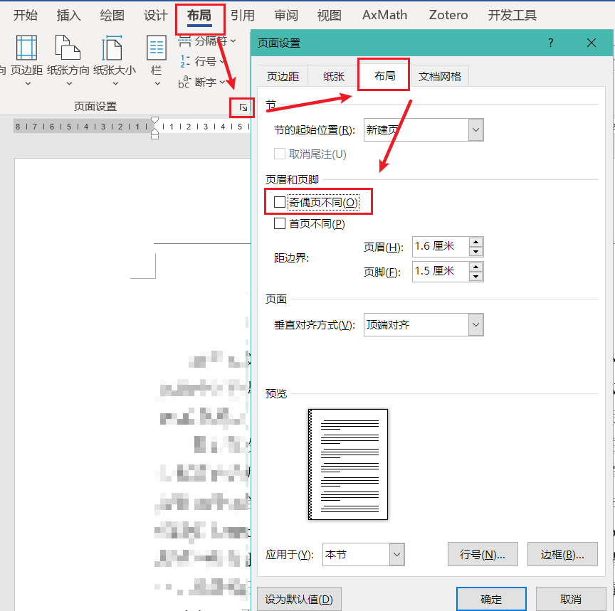

# 摘\Space{4}要{-}

对于论文排版而言，学界通常会采用LaTeX方案，LaTeX虽然有着种种优点，然而却并不是那么容易上手，很多时候我们也不得不提交Word格式的论文。Word虽然上手简单，可要排版出一篇格式工整的论文也并非那么容易。

那么有没有一种方案可以兼得二者的好处呢？或者说，在这中间同时保持对二者的支持呢？在有了pandoc这个工具之后，这个问题似乎有了方向。pandoc作为通用的文档转换器，可以将一种名为`Markdown`的纯文本格式转换为LaTeX，又可以把Markdown转换为Word文件；恰好LaTeX和Markdown因为都是纯文本，转换过程几乎不会受到阻碍。而Markdown本身，又有着两者无可替代的优越性——随着电子设备的不断普及，我们需要在纸张上排版的情况越来越少了，而Markdown正好符合了现代化电子记录的需求：实时渲染，设备无关，轻量化……所以乍一看似乎Markdown就是我们的救星。

然而Markdown因为其本身只是为记录而设计，并没有“格式”的概念，所以对于其而言，想要输出成一篇**符合格式要求**的Word文档，是很困难的。但是pandoc可以支持插件，在转换过程中进行处理！由此，我们的点子便借着这个插件功能出来了——

只需要**制作一个符合格式规范的Word模版**，而后**编写插件**处理中途Word在功能、格式上的问题，即可输出满足要求的成品Word文档

现在，你们看到的，便是由我们半年时间研究出的方案，使用 pandoc 生成出的接近成品的 word 文档。

该文档中的格式，均是来自《重庆大学博士、硕士学位论文撰写格式标准及要求（2019年修订）》、《重庆大学普通本科毕业设计（论文）撰写规范要求》，具体见后文

\newPara{}

\KeyWord{关键词：}排版，论文，格式转换

# **Abstract**{-}

按照排版规定英文标题需要加粗

Let us not wallow in the valley of despair, I say to you today, my friends.

And so even though we face the difficulties of today and tomorrow, I still have a dream. It is a dream deeply rooted in the American dream.

I have a dream that one day this nation will rise up and live out the true meaning of its creed: "We hold these truths to be self-evident, that all men are created equal."

I have a dream that one day on the red hills of Georgia, the sons of former slaves and the sons of former slave owners will be able to sit down together at the table of brotherhood.

I have a dream that one day even the state of Mississippi, a state sweltering with the heat of injustice, sweltering with the heat of oppression, will be transformed into an oasis of freedom and justice.

I have a dream that my four little children will one day live in a nation where they will not be judged by the color of their skin but by the content of their character.

I have a dream today!

I have a dream that one day, down in Alabama, with its vicious racists, with its governor having his lips dripping with the words of "interposition" and "nullification" -- one day right there in Alabama little black boys and black girls will be able to join hands with little white boys and white girls as sisters and brothers.

I have a dream today!

\newPara{}

\KeyWord{Keywords: }pandoc, Markdown, Word

\newSectionAbstract

\toc

👆上面通过`\toc`生成目录

\Style{TOC}图目录

`{ TOC \h \z \c "图" \x}`{=field}

下面这里通过`\newSection`命令来生成一个Word中的分节符。在Word中，只有通过分节之后，才能给不同的节设定不同的页眉页脚以及纸张大小等参数。分节符的作用域为其前方的内容，这里的参数`UpperRoman`表示页码采用“大写罗马数字”表示，也就是从文档最开始的摘要到目录的部分，页码采用大写罗马数字表示。👇

\newSectionTOC

# 功能介绍

这里开始介绍基本功能的使用。

## 标题 English

这里是各级标题，根据论文排版要求，本科论文理科规定了6级标题样式的编号和格式，文科则规定了5级，且编号格式与理科不同；而根据研究生的要求，文理科都只能按照本科理科的样子编号。其中英文标题要求应用加粗效果。

### 三级标题Level Three 3

#### 四级标题Level Four 4

##### 五级标题Level Five 5

###### 六级标题Level Five 6

更多级别的标题在模版中未调整样式，请勿使用

根据需求，“摘要”“参考文献”“附录”等样式虽为一级标题，但是并没有编号，可以通过在标题尾部加上`{-}`来取消编号。

## 脚注

按照规定，脚注是被允许的，[^3]可以直接按照Markdown的脚注格式进行书写[^1]，这里就有了几个脚注了[^2]。脚注的编号可以乱写[^99]，只要一一对应就好[^5]，最后会自动按顺序编好。

需要注意的是，[**脚注中的内联代码无法随脚注一起使用更小的字号**]{#内联代码字号问题}[^footnote-fontsize]

[^3]:脚注：诶，上面的兄弟伙，你说你一根横线在我们脚注脑壳上面，应该跟我们一路对齐的撒，啷个子跟别个那些正文伙到一起去把脑壳歪起生起哟，大家一起对正标齐，看到起多舒服
[^1]:横线：嗐，老弟呀，不是我不想和你们对齐呀，我跟你讲嘛，是楞个的。虽然说我不是脚注，但是我和你们脚注一起走南闯北穿一条裤子的，按理说也该按脚注的待遇来撒，结果那些背时灾舅子上户口的，硬是把我给上成是正文的户口。结果嘞哈斗没得法的了，我现在是正文，只有跟他们正文一路把脑壳歪起了
[^2]:脚注：瓜兮兮，开飞机；神戳戳，骑摩托。嘞些个宝批龙怕是没读过书哦
[^5]:……
[^99]:横线：是撒是撒，唉不摆了不摆了
[^footnote-fontsize]:`some code in footnote`脚注中的内联代码无法随脚注的字号一起改变

## 这是一个没有编号的二级标题{-}

# 其他自定义功能

## 自定义段落样式

:::{style="Figure"}
`\Style{Figure}`这个段落被应用了`Figure`样式，显示效果为段落居中显示
:::

使用`\Style{Figure}`可对当前段落应用名为`Figure`的样式。👇

\Style{Figure}这个段落被应用了`Figure`样式，显示效果为段落居中显示

不推荐使用`\Style{}`功能，该代码只有放在段首的时候才成立，且造成其他功能无法正常显示（仅限使用的地方）

## 自定义文本样式

代码：

```markdown
普通文本，[自定义样式文本1]{custom-style="CommentTok"},[自定义样式文本2]{style="CommentTok"}
```

效果：

普通文本，[自定义样式文本1]{custom-style="CommentTok"},[自定义样式文本2]{style="CommentTok"}

## 下划线

代码：

```markdown
[下划线1]{.underline}，[下划线2]{.U}
```

效果：

[下划线1]{.underline}，[下划线2]{.U}

## 制表符

制表符可以用来对齐文字，在Word中，有普通的制表符（按`Tab`键插入）和特殊的制表符（需要通过菜单插入）。

### 普通制表符

长江，长城，\tab{}黄山，黄河，\tab{}在我心中重千斤

无论何时，\tab{}无论何地，\tab{}心中一样亲

普通制表符默认在文档中按照“两个字符”的位置进行对齐（可在“标尺”中查看），所以这里恰好就把“在我心中重千斤”给对齐到了下一个位置，需要手动在“心中一样亲”之前再加一个制表符才能对齐。

### 特殊制表符

\tabC{}这是一串居中的文字。\tabL{}现在我跑到下一行的最左边了。\tabR{}然后我又到了这一行的最右边。

\tabC{}床前明月光，疑是地上霜。

\tabC{}举头望明月，低头思故乡。

\tabR{}_——李白《静夜思》_

## 换行符分页符空段落生成

### 换行符

有的时候我们需要在一段话的中间换行，而不进行分段，这时候就需要用到换行符，也就是LaTeX中的`\\`，可以用`\newLine{}`实现。👉\newLine{}👈比如这里就到了一个新行当中而没有因为分段产生首行缩进。后面的双语题注也是用的换行符实现的换行不分段。

pandoc也支持在一行末尾通过3个空格来插入换行符，比如这里👉   
👈然后第二行前面不空行，这两行就是同一个段落

### 分页符

这也是Word的中的特殊功能，等同于LaTeX中的`\newpage`，但是这里为了和LaTeX以示区分，采用了更贴近于程序员的“小驼峰命名法”，即应当写成`\newPage{}`

妈妈：不听话就滚到下一页去，眼不见心不烦

\newPage{}

我：呜呜~~妈妈不要我了😥

### 空段落生成

pandoc无法将多余的空行识别为空的段落产生一段垂直间距（比如留出数学题的解题间隔），LaTeX中可以采用生成垂直间距的命令来实现，但Word没有这样的功能，只能用空段落来生成间距。这里采用命令`\newPara{n}`来生成n个空段落。👇

\newPara{3}

👆这里就有了3个空段落。排版规范要求“摘要”部分的“关键词”与正文间隔一行，就是通过这个来插入的空行。

### 空格生成

在Markdown中，连续多个空格会被视为一个，使用`\Space{4}`来生成4个连续空格，例如中文摘要中的`摘\Space{4}要`

摘\Space{4}要

## 调用 metadata

Metadata block:

\metadata{test-metadata-block}

Metadata inline: \metadata{test-metadata-inline}

纯文本 Metadata: \metadataStr{test-metadata-inline}

## 尚未实现的功能{-}

1. LaTeX中的“引理”“定理”“证明”等环境，可通过自定义段落样式实现
2. 图片的并排子图
   * 这个功能得用表格进行嵌套，理解起来很简单，做是能做的
   * 就是逻辑比较复杂，代码写起来应该会很酸爽
3. 附录的公式表格编号
   1. 排版要求规定一级标题“附录”不编号，附录里面的二级标题以`ABCD`编号
   2. 而附录里的图片和表格等用`图A1`的形式编号
   3. 实现起来虽然不复杂，但是要考虑到和普通的题注编号的共存，所以判断逻辑较为复杂

## 目前存在的部分问题

* 文档网格无法与Word相同
  * 问题来自`styles.xml`，有待解决
* pandoc的兼容性问题
  * 输出文档的空格距离比Word小
  * 换行符会导致奇怪的对齐
  * 这两个问题都是因为pandoc默认文档的全局参数设置问题，只能等待pandoc选择继承模版的全局参数时才可以做到
  * 可通过如图操作修复：
  * 
  * 在Word的设置中，选择“高级”-->最下方“以下对象的布局选项”-->勾上“不扩展XXX”和“区分半角全角字符”即可解决

# 公式

\newcommand\degree{°}

勾股定理：设$\triangle ABC$顶点$A$，$B$，$C$的对边分别为 $a$，$b$，$c$，若成立 $$a^2+b^2=c^2$$ 则 $\triangle ABC$是直角三角形，且 $$ \angle ACB=90 \degree.$$

通过预定义的开关开启公式编号功能之后，“行间公式”默认会被编号，实现原理是用一个三列的表格嵌套公式，中间放置公式，右边放置编号，由于该表格的对称性，公式被对齐在正中间。这里可以简单的用一用LaTeX的`\newcommand`命令，由pandoc提供原生支持。

$$\begin{matrix}α & β \\ 3 & 4 \\\end{matrix}$$
$$\begin{pmatrix}α & β \\ 3 & 4 \\\end{pmatrix}$${-}
$$a + b^2 = \frac{c}{d}$$ {#eq:1}
$$\begin{bmatrix}α & β \\ 3 & 4 \\\end{bmatrix}$$

上述4个公式中，第二个公式后的`{-}`同标题一样，表示不编号；\newLine{}
第三个公式后的`{#eq:1}`表示对公式打上名为`eq:1`的标记，就可以进行交叉引用了，使用`[@eq:1]`见公式[@eq:1]完成对该编号的引用

如果要在公式后面输入`{#a}`这样的文字，可以先用空的花括号`{}`隔开，$$x=y_0$${} {#a}像这样

$$
\frac{\partial\lambda}{\partial n}=
\frac{
  \frac{\lambda}{\Delta n^m_{eff}}
  \frac{\partial\Delta n^m_{eff}}{\partial n}
}
{1-
  \frac{\lambda}{\Delta n^m_{eff}}
  \frac{\partial\Delta n^m_{eff}}{\partial\lambda}
}
=\lambda\frac{1}{\Gamma}
\left(
  \frac{1}{\Delta n^m_{eff}}
  \frac{\partial\Delta n^m_{eff}}{\partial n}
\right)
$$

## 公式不编号

TODO

## 公式纯文本保留

TODO

# 定理环境

TODO 这里的代码尚未实现，可以先不看

## 语法定义

```markdown
[极限的$\varepsilon-\delta$定义]{.definition #def:limit}
: 第一段
: 第二段
```

```markdown
[]{.definition}[@Perner-171]
: 这是一个没有名字但是有参考文献引用的定义
```

通过最基本的元素可以这样实现：

```markdown
\Style{Definition}[定义[`{STYLEREF 1 \s}`{=field}.`{SEQ def \* ARABIC \s 1}`{=field}]{#def:limit}]{style="Definition Preffix"} [([极限的$\varepsilon-\delta$定义]{#def:limit:c}[@Philip-159])]{style="Definition Title"}　第一段

\Style{Definition}第二段
```

定义1.3 (极限的$\varepsilon-\delta$定义)第一段

第二段

其中`定义`二字为Markdown的metadata的`proof`参数，数字`1.3`中的分隔符来自`chapDelim`参数

## 手动实现

这里通过最基本的元素手动实现了一个定义

\Style{Definition}[定义[`{STYLEREF 1 \s}`{=field}.`{SEQ def \* ARABIC \s 1}`{=field}]{#def:limit}]{style="Definition Preffix"} [([极限的$\varepsilon-\delta$定义]{#def:limit:c}[@Philip-159])]{style="Definition Title"}　设$\left\{x_{n}\right\}$是一给定数列，$a$是一个实常数。如果对于任意给定的$\varepsilon>0$，可以找到正整数$N$，使得当$n>N$时，成立$$\left|x_{n}-a\right|<\varepsilon$$则称数列$\left\{x_{n}\right\}$收敘于$a$（或$a$是数列$\left\{x_{n}\right\}$的极限），记为$$\lim _{n \rightarrow \infty} x_{n}=a，$$有时也记为$$x_{n} \rightarrow a(n \rightarrow \infty)$$

\Style{Definition}如果不存在实数$a$，使$\left\{x_{n}\right\}$收敘于$a$，则称数列$\left\{x_{n}\right\}$发散。

定义编号：[@def:limit]，定理名称：[@def:limit:c]，定理页码：[@def:limit:page]

# 图片

## 图片的插入


通过上面这样``的语法可以插入一张图片。和公式一样，在有题注的情况下，图片默认编号。

## 图片的标记&尺寸定义

同样也可以采用和公式一样的语法来引用图片的编号，图片甚至可以设置宽度和高度，完整语法为：`{#fig1 weight=3cm height=2cm}`，例如：

{#fig:0 width=3cm height=2cm}

👆上面这张图有编号有标签`fig:0`，\newLine{}下面这张图无编号无标签👇

{- width=3cm height=1cm}

这里是一个没有题注的图片👇

{- width=3cm height=1cm}

## 双语题注

有时候图片的题注需要同时有中文和英文，使用语法`{}`的方式生成英文题注。其中中文题注的编号自动完成，`\sc{}`命令通过在中文题注后面插入换行符和英文题注的前缀及序号来实现英文题注的插入，该参数可在metadata中自定义

{#fig:DoubleCaption height=2cm}

## 图片的引用

与公式不同的是，由于图片的复杂要求，以对上图为例，对其编号的引用语法为`[@fig:DoubleCaption]`，对其中文题注内容的引用语法为`[@fig:DoubleCaption:c]`，对其英文题注的引用语法为`[@fig:DoubleCaption:sc]`。（`sc`取`second content`）

即图👉[@fig:DoubleCaption]👈的中文题注内容为👉[@fig:DoubleCaption:c]👈，英文题注内容为👉[@fig:DoubleCaption:sc]👈。无论图片是否具有英文题注，其中文题注的引用都需要有后缀`:c`

---

图1：单语有标签 `fig:1`（编号标签`fi:1`，中文标题标签`fig:1:c`）

{#fig:1 height=1.5cm}

图2：双语有标签 `fig:2`（同图 1，外加英文标题标签`fig:2:sc`）

{#fig:2 height=1.5cm}

图3：无编号双语标签

{- height=1.5cm}

---

上面3张图片中，图[@fig:1]，其题注为[@fig:1:c]；图[@fig:2]，其中文题注为：[@fig:2:c]，英文题注为：[@fig:2:sc]。

# 表格

## 普通表格

普通的表格可以直接用Markdown的表格语法。根据学校的要求，我们把默认的表格样式设置为了三线表。**套用表格样式的功能因为pandoc不支持，故目前无法实现**。

| 第一列 |  第2列   | 第$x$列 |
| :----- | :------: | ------: |
| 左对齐 | 居中对齐 |  右对齐 |
| 数字   |   1231   |    4654 |
| 空     |   sum    |       - |

: 这里是表头\sc{}English Table Title {#tbl:test}

CQU要求表格之后空一行，可在metadata中选择自动生成这个空行。

上面对题注进行了标记，注意需要在尾部使用空格将花括号和前面的内容分开。

表格编号：[@tbl:test]，中文题注：[@tbl:test:c]，英文题注：[@tbl:test:sc]

显而易见，这个表格不能有高级操作，不能合并表格（其实pandoc是支持的，但是无法输出到Word，Markdown也没有对应的语法）

## 通过域代码引入Word中的复杂表格

在reference.docx中制定好表格样式，并将其复制到新的表格，而后即可“自由”制作表格（例如合并单元格，长表格，对齐等），使用以下域代码（`{IncludeText}`）引入即可（亦可用来引入其他任何文档），该域代码只支持绝对路径，但引入之后会把原来的文档内容保留在本文档内，也就是只要不强行更新，即使发给别人别人仍然可以正确查看。

因为绝对路径的问题，这里我们做了个`\includeDoc{}`功能来使用相对路径引入文件，该功能只能单独成段使用。

注意，引入的文档中的样式会使用reference.docx中的对应样式，因此无需在新的文档中修改样式内容，只需应用对应样式即可，这里推荐复制reference.docx中的`Compact`样式，在本文所用的reference.docx中，该样式没有首行缩进，是制作表格比较良好的选择，同时也是pandoc默认使用的表格样式。

\includeDoc{Table.docx}

# 代码和文本块引用

这两个语法属于Markdown的语法，学校排版要求并未做出明确规定

## 代码

### 内联代码

首先是一行内部的内联代码👉`这里是内联代码some code`👈

### 代码块

接着是单独成段出现的代码块

```python
if a == 1:
    print("str")
```

```text
纯文本测试
这里和上面的两行python代码会在一个框里
plain text
```

下面是一段xml代码

```xml
<w:lvl w:ilvl="3">
    <w:start w:val="1"/>
    <w:numFmt w:val="decimalEnclosedCircleChinese"/>
    <w:pStyle w:val="4"/>
    <w:lvlText w:val="%4"/>
    <w:lvlJc w:val="left"/>
    <w:pPr>
        <w:ind w:left="0" w:firstLine="0"/>
    </w:pPr>
</w:lvl>
```

下面是一段python代码

```python
# 绝对素数.py
# 将自然数区间10-1000中所有绝对素数挑选出来，每行打印输出5个。绝对素数是：一个数和其反序数都是素数。
List = []  # 创建空数组
flag = 1
count = 0  # 计数器初始状态为0
for i in range(10, 1001):  # 自然数i在10-1000之间
    for j in range(2, i):
        if i % j == 0:  # 自然数i是否是素数
            flag = 0
            break  # 只要遇到一个因数，就可以不用进行后面的循环了
    if flag == 1:  # 如果经过上述判断flag还是1，说明正向是素数，现在判断反向素数
        s = str(i)
        m = int(s[::-1])
        for n in range(2, m):
            if m % n == 0:  # 自然数i的反序数m是否是素数
                flag = 0
                break  # 只要遇到一个因数，就可以不用进行后面的循环了
    if flag == 1:  # 将绝对素数全部添加至列表
        List.append(i)
    flag = 1
for k in List:  # 将list打印输出，五个一换行
    print(k, end=' ')
    count = count+1
    if count % 5 == 0:
        print('\n')

```

## 引用文本块

下面是一段对《歌剧魅影》剧本唱段台词的引用块。（这里是借助文本编辑器通过正则表达式批量生成的规范化文本，仅作炫技展示之用）

> \tabC{}In dreams he came   
> \tabC{}♪ 梦境中他近我身旁
> 
> \tabC{}That voice to me   
> \tabC{}♪ 他的声音召唤着我
> 
> \tabC{}And speaks my name   
> \tabC{}♪ 喃喃轻诉我的名字
> 
> \tabC{}And do I dream again   
> \tabC{}♪ 我是否又重回梦境
> 
> \tabC{}For now I find   
> \tabC{}♪ 此时此刻我才发现
> 
> \tabC{}The Phantom of the Opera is there   
> \tabC{}♪ 歌剧魅影就在这里
> 
> \tabC{}Inside my mind   
> \tabC{}♪ 潜伏在我心灵深处
> 
> \tabC{}Sing once again with me   
> \tabC{}♪ 再次与我一起
> 
> \tabC{}Our strange duet   
> \tabC{}♪ 同唱这奇妙的旋律

# 页眉页脚

## 原理解释

pandoc对页眉页脚的处理极其困难。

首先，每一个Word文件的尾部都存在一个“分节符”，通过指定rId值来控制这一节的页眉页脚具体指向哪个文件。也就是说，Word文档的页眉页脚实际上受控于分节符，通过分节符分配页眉页脚所在xml文件的rId值来确定具体显示哪一个页眉页脚。

pandoc会复制模版文件的第一个分节符内容放置于输出文档的尾部作为输出文档的最后一个**用户无法手动插入**的分节符，且pandoc会保证这个分节符里的页眉页脚的rId指向与模版文件分节符相同的xml文件，包装页眉页脚的一致性。

如果对文档嵌入自行添加的分节符，那么需要在分节符中**手动**指定对应页眉页脚的rId，但问题是，我们如何知道其rId值？

Word对rId有自己的理解，也就是说经过Word保存之后的文档，rId会被Word理顺（比如模版），而pandoc照着这个模版生成输出文档时，又会对rId按照自己的顺序理顺，造成模版的rId和输出文件的rId无法保持一致。

解决方案是，先在模版中创建好所有需要使用的页眉页脚，使Word中的rId固定，进而固定pandoc输出文件的rId，然后通过拆解文件手动对比前后的rId，找到输出文件中所期望的页眉页脚对应的rId值。

这里需要注意的是：

1. pandoc会从模版文件**第一个**分节符的内容放到输出文件的尾部，并保证这个分节符里的rId指向与原来相同的文件，故输出文档的最后一节的分节符参数与模版文档的第一节分节符参数一致，拥有相同的页眉页脚，需要注意这里的顺序问题
2. 如果rId没有对上，比如第一次输出时，不知道需要的页眉页脚的rId是多少，Word会报错，需要手动解压输出文档然后查看各个页眉页脚，找到需要的xml然后寻找其rId

## 单双页眉切换

编辑Markdown的metadata项目`singlePage`，根据模版中域代码的设定（详见附录[@sec:页眉:c]），当`singlePage`为1时表示单面打印，遵循排版要求中的单面规则，当`singlePage`不为1时（建议设置为0），表示双面打印，遵循排版要求中的双面规则。

亦可在导出的Word中手动设置Word的自定义属性页面看见此设置，如图


由于此设定采用了特殊的域代码`DOCPROPERTY`，该域代码无法自动完成更新（因为在页眉中，甚至不能全选文档通过`F9`一键完成更新），因此`需要手动对每一个不同的页眉更新域代码`（将光标置于域代码中可采用快捷键`F9`完成更新）

注：单双页面的设定依赖于Word文档中页眉页脚的“奇偶页不同”设定，但由于学校排版要求中“装订线”设定的存在，这个设置开启时，Word认为这是在双面打印，奇数页会在左侧留出装订线的空间，偶数页会在右侧留出装订线的空间；而这个设置关闭时，Word认为这是在单面打印，不管奇偶页都会在页面左侧留出装订线的空间，因此，**除了需要手动更新域代码以切换奇偶页的页眉页脚之外，还需要手动切换“奇偶页不同”开关**



# 交叉引用逻辑

## 书签标注{#sec:jcyy}

可以通过标记书签，然后对书签进行引用，实现对书签的“内容”，“页码”，“编号”（如果有）的引用

**对标题标记**：在标题后面加上`{#sec:jcyy}`这样的标记（这里对上面的一级标题进行了标注）

**对普通内容的标记**：通过`[文本]{#bookmark_name}`这样的方式，用英文中括号把需要标注的文本框起来，后面写上花括号和书签名字

## 引用（书签）

在Word中，对图表，标题等任意“编号”项目的编号引用都是通过书签实现的，在可视化的“交叉引用”窗格中引用时，Word会自动对被引用的编号标记书签，这类Word自动标记的书签会以`_`下划线开头，即`_XXXXXXX`的形式，默认在书签面板中隐藏。

在Markdown中，我们无法像Word一样生成隐藏式的书签，因为在Word之外根本就没有可视化的“交叉引用”窗格嘛。但是我们在引用时会手动设定“label”嘛，于是我们就通过对`label`的设定来实现各种交叉引用的处理。

这里有个问题就是：通常在LaTeX中，对公式或者图片进行引用时，得到的都是**编号**，而在Word中，通常直接得到的书签标记的是**内容**，比如对题注的标记，LaTeX中得到的是编号，而Word中得到的是题注的文本。

那我们在这里也把书签默认处理成对编号的引用如何？可Word里的书签不是所有的书签都有编号啊，万一书签没有对应的编号，就会产生错误引用。

为了解决这个问题同时保持和LaTeX以及其他插件的兼容性，我们做出如下规定：

* 若某个书签的名字中含有`:`冒号，我们便将该书签视为对编号项的引用，记冒号前面的内容为“标识符”，用以区分不同的编号类型
  * 例如，`fig:abc`中存在冒号，我们认为这就是一个编号项，且冒号前面的`fig`为其标识符
  * 这里规定默认的标识符有：
    * 章节：`sec`
    * 图片：`fig`
    * 表格：`tbl`
    * 若干定理环境的标识符`thm`，`prf`等
  * 通过`[@fig:xxx]`可以得到其编号
  * 通过`[@fig:xxx:c]`可以得到其内容（字母`c`取自`content`）
  * 特殊：因为公式`eq`编号仅有编号，故公式无`eq:xxx:c`写法
* 若某个书签中不含有冒号，我们认为这是一个普通的文本书签
  * 例如，`jcyy`中不存在冒号，我们认为这是一个文本引用
  * 通过`[@jcyy]`得到其内容（域代码`REF jcyy \h`）
  * 通过`[@jcyy:no]`得到其编号，若没有，则会出现引用错误（域代码`REF jcyy \r \h`）
* 任意书签通过`[@xxx:page]`可以得到其页码（域代码`PAGEREF xxx \h`）

对于上述提到的各个“标识符”，对应章节有其实现方式，对于列表项目或脚注等内容，可以通过对“整个项目”标记带有自定义标识符的书签，而后通过交叉引用实现对其编号的引用，例如：

1. 123
2. [456]{#lst:456}
3. 789

上述列表中，第[@lst:456]项位于第[@lst:456:page]页，内容为[@lst:456:c]

# 交叉引用测试

这一章对各种交叉引用进行测试。

## 标题引用测试：有前缀{#sec:title-no}

对标题的引用以及对编号段落的引用方式完全相同，“编号段落”指前方带有编号的段落，例如有序列表。

```
## 标题引用测试：有前缀{#sec:title-no}
标题编号：[@sec:title-no]
标题内容：[@sec:title-no:c]
```

标题编号：[@sec:title-no]
标题内容：[@sec:title-no:c]

## 标题引用测试：无前缀{#title}

无前缀的编号段落引用需要用`:no`后缀实现

```
## 标题引用测试：无前缀{#title}
标题编号：[@title:no]
标题内容：[@title]
```

标题编号：[@title:no]
标题内容：[@title]

## 题注编号引用测试：有前缀

题注的引用适用于表格，图片，定理环境。

| 测试表格 |
| :------: |
| 测试表格 |

: 这是中文表格题注\sc{}This is English Table Caption {#tbl:table-no}

```
表格编号：[@tbl:table-no]
中文题注：[@tbl:table-no:c]
英文题注：[@tbl:table-no:sc]
```

表格编号：[@tbl:table-no]
中文题注：[@tbl:table-no:c]
英文题注：[@tbl:table-no:sc]

## 题注编号引用测试：无前缀

| 测试表格 |
| :------: |
| 测试表格 |

: 这是中文表格题注\sc{}This is English Table Caption {#table}

```
表格编号：[@table]
中文题注：[@table:c]
英文题注：[@table:sc]
```

表格编号：[@table]
中文题注：[@table:c]
英文题注：[@table:sc]

## 普通内容引用测试

普通内容的引用用来验证对于含有奇奇怪怪前后缀或者无前后缀的内容的引用。

```
[这是一串测试用的纯文本]{#text}
文本内容：[@text]

[这是一串有着奇怪前缀的纯文本]{#qwe:text}
文本内容：[@qwe:text]

[这是一串有着奇怪前缀和后缀的纯文本]{#qwe:text:xxx}
文本内容：[@qwe:text:xxx]
```

[这是一串测试用的纯文本]{#text}
文本内容：[@text]

[这是一串有着奇怪前缀的纯文本]{#qwe:text}
文本内容：[@qwe:text]

[这是一串有着奇怪前缀和后缀的纯文本]{#qwe:text:xxx}
文本内容：[@qwe:text:xxx]


# 域代码{#sec:ydm}

## 标题的引用

这里测试标题书签的引用，记标题书签名为`bkn`。

* 引用内容文本的语法为：`[@sec:bkn:c]`
* 引用编号的语法为：`[@sec:bkn]`
* 引用页码的语法为：`[@sec:bkn:page]`

以下是具体的引用测试：

* 标题文本：[@sec:ydm:c]
* 标题编号：[@sec:ydm]
* 标题页码：[@sec:ydm:page]

## 域代码的插入

使用`` `{域代码}`{=field} ``可插入自定义的域代码，尾部的`{=field}`可以用`{=docx}`代替。

可以通过域代码来实现对书签，各种标题、编号的引用。上述的标题的各种引用，就是通过插入不同的域代码实现的，对于未实现的引用功能，可以自行查阅Word的域代码文档手动实现[^field_code]。至于具体的“题注”“公式编号”等的域代码，因为单独做了功能封装且较为复杂，这里不表，相信Word熟手是很得心应手的。

插入域代码时，还可以指定域代码在未更新时显示的内容，使用语法`` `{域代码|显示内容}`{=field} ``即可（默认情况下，Word需要更新域代码内容才能正确显示其具体的内容，使用该语法可在未更新的情况下手动指定，而不会显示为空白）。

例如，使用域代码`` `{REF sec:jcyy|域代码还未更新}`{=field} ``可在未更新域代码的情况下显示为“域代码还未更新”，更新后将会显示上述的一级标题内容。

效果：`{REF sec:jcyy|域代码还未更新}`{=field}

[^field_code]: Word 中的域代码列表：[https://support.microsoft.com/zh-cn/office/word-%E4%B8%AD%E7%9A%84%E5%9F%9F%E4%BB%A3%E7%A0%81%E5%88%97%E8%A1%A8-1ad6d91a-55a7-4a8d-b535-cf7888659a51](https://support.microsoft.com/zh-cn/office/word-%E4%B8%AD%E7%9A%84%E5%9F%9F%E4%BB%A3%E7%A0%81%E5%88%97%E8%A1%A8-1ad6d91a-55a7-4a8d-b535-cf7888659a51)

## 书签的域代码引用

在Word中，书签是可以嵌套引用的，例如，名为`A`的书签指向文本`B`，而文档中恰好有名为`B`的书签指向文本`C`，则可以通过嵌套引用通过`A`来引用书签`B`指向的文本`C`。

```text
书签：[被引用的文字]{#test_ref}、[test_ref]{#test_ref_ref}、[test_ref_ref]{#test_ref_ref_ref}
Ref引用：`{Ref test_ref}`{=field}、`{Ref {Ref test_ref_ref|wtf}}`{=field}、`{Ref {Ref {Ref test_ref_ref_ref}}}`{=field}
```

第一行内容即定义了3个“套娃”书签，在第二行内容中将通过域代码实现嵌套引用，最终3段引用都将显示为`被引用的文字`这一相同文本

书签：[被引用的文字]{#test_ref}、[test_ref]{#test_ref_ref}、[test_ref_ref]{#test_ref_ref_ref}

Ref引用：`{Ref test_ref}`{=field}、`{Ref {Ref test_ref_ref|wtf}|嵌套Ref域}`{=field}、`{Ref {Ref {Ref test_ref_ref_ref}|嵌套Ref域}|套娃}`{=field}

# 技术性内容

## tex 命令内的 markdown 文本解析

### 行间内容示例

\newcommand\test{abc}

\parse{$\frac{\test}{b}$}

$\frac{\test}{b}$

行内公式：\parse{分数 $\frac{\test}{c}$}

行内公式：分数 $\frac{\test}{c}$

``` markdown
\newcommand\test{abc}

\parse{$\frac{\test}{b}$}

$\frac{\test}{b}$

行内公式：\parse{分数 $\frac{\test}{c}$}

行内公式：分数 $\frac{\test}{c}$
```

### 块内容示例

\parse{$$\frac{\test}{d}$$}

$$\frac{\test}{d}$$

``` markdown
\parse{$$\frac{\test}{d}$$}

$$\frac{\test}{d}$$
```

$$\frac{\test}{d}$$

$$\frac{\test}{d}$$

``` markdown
$$\frac{\test}{d}$$

$$\frac{\test}{d}$$
```

### 嵌套示例

\parse{公式 \test: \parse{$\test$}}

``` markdown
\parse{公式 \test: \parse{$\test$}}
```

# 参考文献的插入

参考文献的插入和LaTeX类似，通过一个`.bib`文件来实现，该文件可通过任意文献管理软件导出，为纯文本格式，通过`[@xxx]`这样的语法来进行引用。

而参考文献的格式由一个`.csl`格式的文件来控制，该文件可从citationstyle.org组织的github仓库下载[https://github.com/citation-style-language/styles](https://github.com/citation-style-language/styles)。也就是我们可以简单的替换一下这个文件，实现参考文献样式的“一键”切换

这里右上角会出现参考文献的引用[@JifaLingling-132]

一条参考文献不够，再来两个一起试试[@Perner-171; @WeichselbraunGindl-160; @YangGuo-164]

注意这里的参考文献是有超链接的，即，按住`Ctrl键`点击上标的参考文献数字，即可跳转到参考文献列表对应的文献处。

# 参考文献{-}

pandoc默认参考文献会生成在文档的最后方，但根据论文规范，参考文献之后还有“附录”，所以这里通过命令`\Reference`来实现在任意位置插入参考文献👇，根据排版要求，参考文献的内容采用五号字体。

\Reference{}

# 附录{.appendix}

学校要求附录的字号为五号，因此这里需要通过在标题尾部写上`{.appendix}`来让插件识别并处理。

## \Style{AppendixHeading2}附录1

这是附录A中的内容，对附录中图片和公式的编号处理目前尚未完成。

## \Style{AppendixHeading2}附录2

附录B中的内容

由于附录的字号比正文小，所以这里测试一下在正文中的内联代码字号是否正常👉`内联代码code code`👈可见内联代码的字号并未跟随改变，和前文（见[@内联代码字号问题:page]页）中提到的脚注中的代码一样。

## [\Style{AppendixHeading2}单双面打印的页眉域代码]{#sec:页眉 -}

* 摘要和正文
  * 单面打印：左边为`type`文本，右边为一级标题
  * 双面打印：奇数页居中为一级标题，偶数页居中为`type`文本
* 目录
  * 单面打印：左边为`type`文本，右边为`TOC Heading`样式
  * 双面打印：奇数页居中为一级标题，偶数页居中为`type`文本

不管是单面打印还是双面打印，这里都得设置页眉页脚为“奇偶页不同”，然后用域代码判断是否为单面打印，最后用域代码分左中右3个部分用特殊的制表符分隔跳转。

这里用类python的代码格式先描述域代码，方便后续照着修改查证

```python
# 奇数页面
if singlePage=="1":
    "type
    \tabR{}
    一级标题域代码"
else:
    "\tabC{}
    一级标题域代码"

# 偶数页面
if singlePage=="1":
    "type
    \tabR{}
    一级标题域代码"
else:
    "\tabC{}
    type"
```

若在目录部分，将“一级标题域代码”换成目录的域代码即可

其中，

* `singlePage`域代码为`{DOCPROPERTY  singlePage  \* MERGEFORMAT}`
* `type`域代码为`{DOCPROPERTY  type  \* MERGEFORMAT}`
* 一级标题域代码分为标题编号域代码和标题域代码，而标题编号域代码又需要先判断标题编号是否存在（和数字0比较）
  * 标题编号域代码为`{IF { STYLEREF  "标题 1" \n  \* MERGEFORMAT } > 0 {STYLEREF  "标题 1" \n  \* MERGEFORMAT} }`
  * 标题域代码为`{STYLEREF  "标题 1"  \* MERGEFORMAT}`
* 目录的域代码为`{STYLEREF  "TOC 标题"  \* MERGEFORMAT}`

故连起来之后，最终域代码为

1231231

* 摘要和正文奇数页面

    ```text
    {IF {DOCPROPERTY  singlePage  \* MERGEFORMAT}="1" "{DOCPROPERTY  type  \* MERGEFORMAT}\tabR{}{IF { STYLEREF  "标题 1" \n  \* MERGEFORMAT } > 0 {STYLEREF  "标题 1" \n  \* MERGEFORMAT} }{STYLEREF  "标题 1"  \* MERGEFORMAT}" "\tabC{}{IF { STYLEREF  "标题 1" \n  \* MERGEFORMAT } > 0 {STYLEREF  "标题 1" \n  \* MERGEFORMAT} }{STYLEREF  "标题 1"  \* MERGEFORMAT}"}
    ```

* 摘要和正文偶数页面

    ```text
    {IF {DOCPROPERTY  singlePage  \* MERGEFORMAT}="1" "{DOCPROPERTY  type  \* MERGEFORMAT}\tabR{}{IF { STYLEREF  "标题 1" \n  \* MERGEFORMAT } > 0 {STYLEREF  "标题 1" \n  \* MERGEFORMAT} }{STYLEREF  "标题 1"  \* MERGEFORMAT}" "\tabC{}{DOCPROPERTY  type  \* MERGEFORMAT}"}
    ```

注意其中的`\tabC{}`和`\tabR{}`不是域代码而是在域代码中手动插入的特殊制表符

---

文档最后这里也是有一个分节符的，这个分节符是文档自带的，在pandoc转换的过程中，文档尾部的分节符会从模版中继承下来，也就不需要手动设定了。这里的分节符在模版中已经设定好，采用阿拉伯数字从1开始编号。👇
